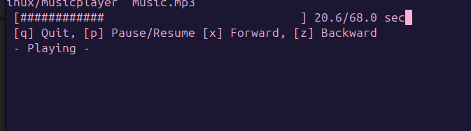

# README.md

# MusicPlayer

It is a simple CLI audio player written in Go. It supports mp3 playback, pause/resume, seeking, and a progress bar.

## Purpose
- Play music from the terminal
- Designed for old/low-end computers
- Minimalistic and fast

## Dependencies
- [Go](https://golang.org/) >= 1.18
- [faiface/beep](https://github.com/faiface/beep)
- [faiface/beep/mp3](https://github.com/faiface/beep)
- Linux (CLI version)

## Build

1. **Using build script**
    ```sh
    ./build.sh
    ```
    or manually:
    ```sh
    go build -o builds/linux/musicplayer ./cmd/musicplayer
    ```

## Usage

```sh
./builds/linux/musicplayer /path/to/file.mp3
```

### Controls

```
[q] Quit, [p] Pause/Resume, [z] Forward, [x] Backward
```

## Example

```sh
./musicplayer ~/Music/song.mp3
```

## Screenshot



## License

See [LICENSE](LICENSE).